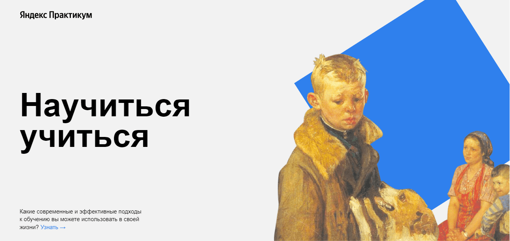

<h1>Учебный проект "Научиться учиться"</h1>

<h2>Описание проекта</h2>

Данный [проект](https://fe1ch.github.io/how-to-learn/) был сделан в рамках образовательной программы [Яндекс.Практикума.](https://practicum.yandex.ru/) Проект представляет собой простой одностраничный сайт на тему современных и эффективных методов обучения.

<h2>Стек технологий</h2>

<h2>Инструкция по установке</h2>

Клонируем репозиторий:
git clone https://github.com/fe1ch/how-to-learn.git

Открываем скачанный репозиторий любым редактором кода(PhpStorm, Visual Studio) и развлекаемся на своё усмотрение.

<h2>Методология и процесс создания</h2>
Работа была выполнена в 2 этапа. В ней реализованы знания, навыки и техники, изученные за первый месяц обучения профессии веб-разработчика. 
На первом этапе было сверстано 6 блоков с использованием следующих технологий: флексбокс-верстки и позиционирования элементов, структура классов выстроена в соответствии с методологией БЭМ, применены семантические теги. 
На втором этапе было добавлено 5 блоков с подключением анимаций и трансформации к элементам (через кейфреймы и псевдоклассы), введены iframe. В проекте переработан способ организации файлов и кода, согласно структуре Nested по методологии БЭМ - изначально файлы группировались по своим типам.

<h2>Усовершенствование кода</h2>

1. Код может быть сделан кроссбраузерным после освоения материала по подключению автопрефиксеров. 
2. Данный проект можно адаптировать под различные устройства.
